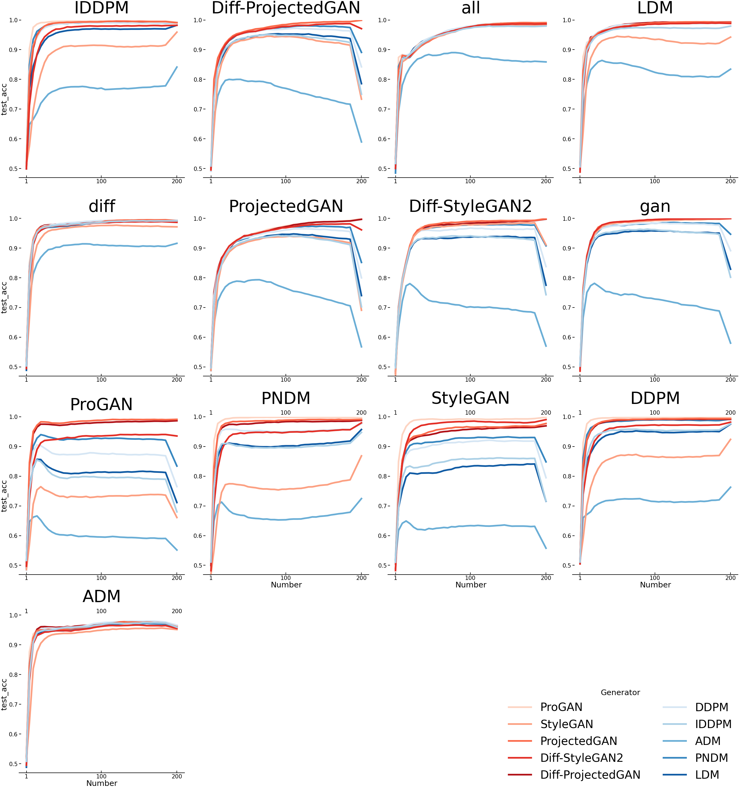
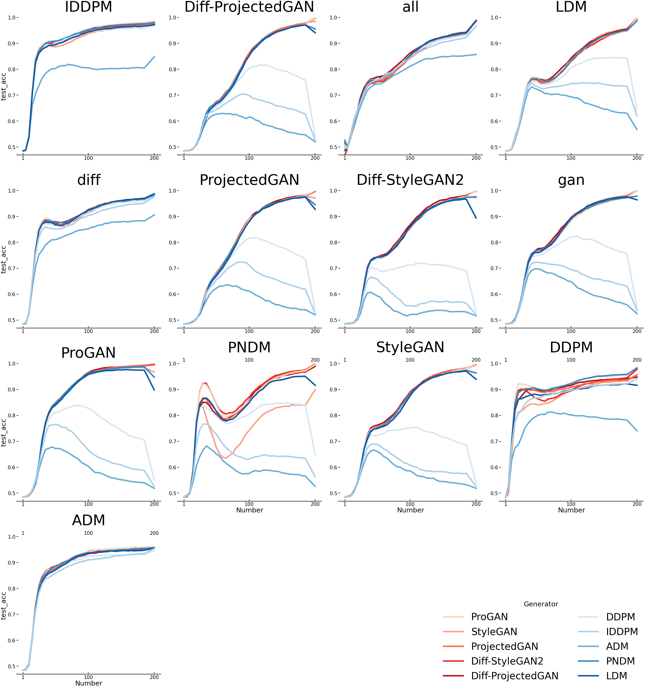
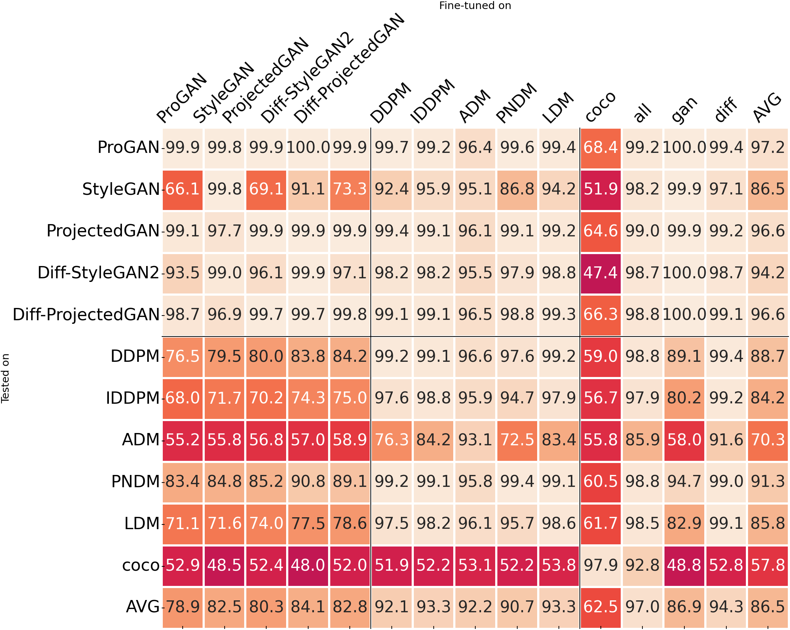
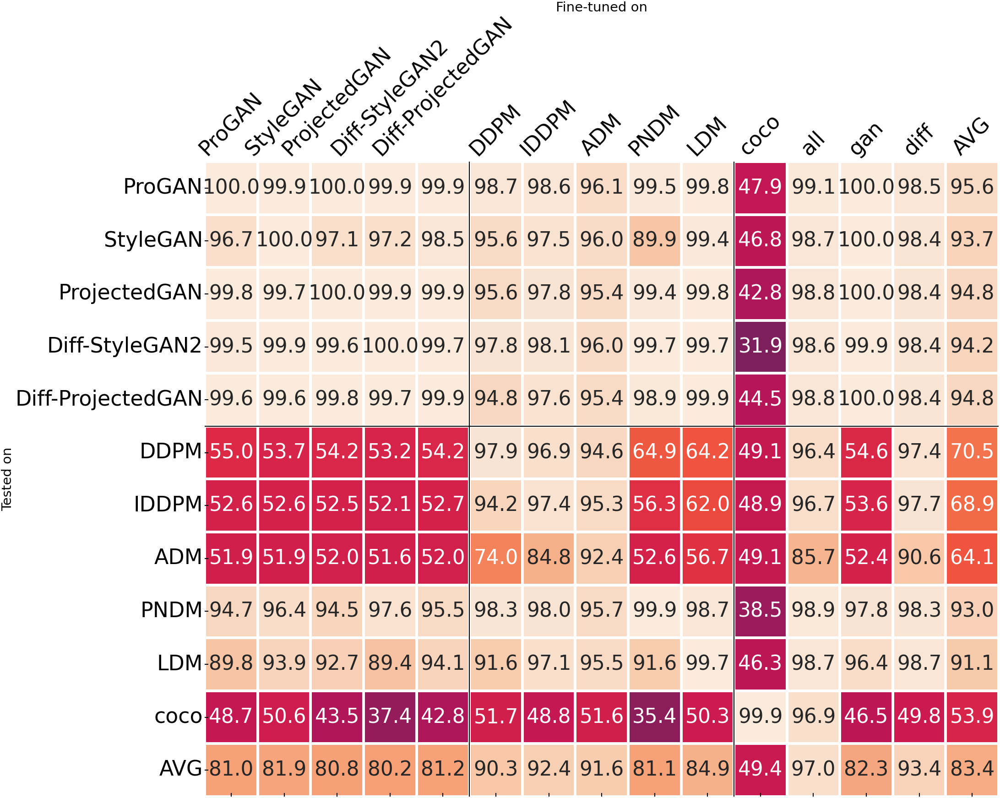

# The Role of Middle Frequencies in General Deepfake Detection


## Overview 

This thesis investigates the effects of frequency manipulation on the embeddings of Visual Foundation Models, specifically Clip and Dino, in the realm of deepfake detection. We designed a series of experiments to analyze how image encodings by various Generative Adversarial Networks  and Diffusion Models change when frequency information is altered. Our focus was on the dependency of these models on frequency artifacts, as highlighted in previous research. Our findings contrast with earlier studies, revealing that Clip is indeed influenced by frequency domain artifacts. While Clip performs adequately in the absence of these artifacts, their presence during training cannot always be guaranteed. We also discovered that DINO outperforms CLIP (by 10\% for PD@1) when trained exclusively on GAN's and tested on diffusion models, highlighting its superior performance in terms of generalization. Notably, DINO demonstrates remarkable resilience to low-pass filtering, only affected by intense filters, whereas CLIP shows a more gradual performance decline. We postulate that Dino's robustness is partly due to its student-teacher knowledge distillation training, which seems to foster a strong low-to-high frequency correspondence and stronger entropy in the lower frequency domain. 


## Results

<p float="left">
  
  
</p>

<p float="left">
  
  
</p>


### Installation

Requires `python>=3.8`

Create Vitual Environment:
```bash
python3 -m venv .venv && source .venv/bin/activate
```

Install the requirements:
```bash
pip install -r requirements.txt
```

### Create Example Data: 

Please follow [Rickers](https://github.com/jonasricker/diffusion-model-deepfake-detection) implementation to create the example data.


### Train Models. 

Here are the scripts to train the linear layer. The code is not efficient, yet to storage problems this was to only feasable way. We would recommand to create the embeddings before hand to improve processing time drastically.

#### Train Classifier

Cross Entropy 
```bash
python train.py -et DinoV2 -ec facebook/dinov2-giant -hs 1536 -mn DinoV2  -sp ./results -en cross_entropy_no_permutations -ht linear -nm 1 -lt BCE --num_epochs 5 --for_all

python train.py -et OpenClip -ec laion2b_s34b_b88k -hs 1024 -mn OpenClip  -sp ./results -en cross_entropy_no_permutations -ht linear -nm 1 -lt BCE --num_epochs 5 --for_all

python train.py -et DinoV2 -ec facebook/dinov2-giant -hs 1536 -mn DinoV2  -sp ./results -en cross_entropy_lowpass_low_frequency -ht linear -nm 1 -lt BCE --num_epochs 5  --for_all -ft butterworth_lowpass


python train.py -et OpenClip -ec laion2b_s34b_b88k -hs 1024 -mn OpenClip  -sp ./results -en cross_entropy_lowpass_middle_frequency -ht linear -nm 1 -lt BCE --num_epochs 5  --for_all -ft butterworth_lowpass

```

### Create Example FFTs Manipulations

Create lowpass filter with filter_radius increments of 5
```bash
python3 core/fft.py -p ./data/example/000_frame0.png -e lowpass_butterworth -sp ./results/example_data -t lowpass_butterworth -r 5
```

create a highpass
```bash
python3 core/fft.py -p ./data/example/000_frame0.png -e highpass_butterwoth -sp ./results/example_data -t butterworth_highpass -r 5
```
create a bandPass
```bash
python3 core/fft.py -p ./data/example/000_frame0.png  -tip 00000001.png -e butterworth_bandpass_filter_mask -sp ./results/example_data -t butterworth_bandpass -r 5
```
create a FDA
```bash
python3 core/fft.py -p 00000001.png   -e FDA -sp ./results/example_data -t FDA -r 5
```

### Run Evaluation

Here we run the evualuation of the different filters on the coco dataset trained model.
For each run, we save the embeddings from the encoder and the embeddings of the linear layer. 

First we test the impact of the low_pass filter on the embedding spaces for DinoV2 and Clip
```bash
python evaluation.py -et DinoV2 -mc /home/wustl/Dummy/Wustl/Deepfake/MasterThesis/model/checkpoints/cross_entropy_no_permutations/DinoV2_ADM_1536_linearepoch=4-val_loss=0.19.ckpt -ec facebook/dinov2-giant -hs 1536 -mn DinoV2 -ft butterworth_lowpass -sp ./results -en butt_low_5_ce -nm 1 --loss_type BCE --for_all

python evaluation.py -et OpenClip -mc /home/wustl/Dummy/Wustl/Deepfake/MasterThesis/model/checkpoints/cross_entropy_no_permutations/ -ec laion2b_s34b_b88k -hs 1024 -mn OpenClip -ft butterworth_lowpass -sp ./results -en butt_low_5_ce -nm 1 -ht linear  --loss_type BCE --for_all


python evaluation.py -et DinoV2 -mc /home/wustl/Dummy/Wustl/Deepfake/MasterThesis/model/checkpoints/cross_entropy_no_permutations/DinoV2_ADM_1536_linearepoch=4-val_loss=0.19.ckpt -ec facebook/dinov2-giant -hs 1536 -mn DinoV2 -ft FDA -sp ./results -en fda_ce -nm 1 --loss_type BCE --for_all


python evaluation.py -et OpenClip -mc /home/wustl/Dummy/Wustl/Deepfake/MasterThesis/model/checkpoints/cross_entropy_no_permutations/ -ec laion2b_s34b_b88k -hs 1024 -mn OpenClip -ft FDA -sp ./results -en fda_ce -nm 1 --loss_type BCE --for_all 

```

Lowpass with Filtered Images and Permutations
```bash
python evaluation_fast.py -et DinoV2 -mc /home/wustl/Dummy/Wustl/Deepfake/MasterThesis/model/checkpoints/cross_entropy_no_permutations/ -ec facebook/dinov2-giant -hs 1536 -mn DinoV2 -ft butterworth_lowpass -sp ./results -en no_permutations -nm 1 --loss_type BCE --for_all

python evaluation_fast.py  -et OpenClip -mc /home/wustl/Dummy/Wustl/Deepfake/MasterThesis/model/checkpoints/cross_entropy_no_permutations/ -ec laion2b_s34b_b88k -hs 1024 -mn OpenClip -ft butterworth_lowpass -sp ./results -en no_permutations -nm 1 -ht linear  --loss_type BCE --for_all


python evaluation_fast.py  -et OpenClip -mc /home/wustl/Dummy/Wustl/Deepfake/MasterThesis/model/checkpoints/cross_entropy_lowpass_middle_frequency/ -ec laion2b_s34b_b88k -hs 1024 -mn OpenClip -ft butterworth_lowpass -sp ./results -en butt_low_middle_freq_ce -nm 1 -ht linear  --loss_type BCE --for_all

python evaluation_fast.py -et DinoV2 -mc /home/wustl/Dummy/Wustl/Deepfake/MasterThesis/model/checkpoints/cross_entropy_lowpass_middle_frequency/ -ec facebook/dinov2-giant -hs 1536 -mn DinoV2 -ft butterworth_lowpass -sp ./results -en butt_low_middle_freq_ce -nm 1 --loss_type BCE --for_all

```


```bash
python frequency_analysis.py /home/wustl/Dummy/Wustl/Deepfake/MasterThesis/data/lsun_bedroom/test /home/wustl/Dummy/Wustl/Deepfake/MasterThesis/results/data_paper/spectral fft_hp --img-dirs Real ProGAN StyleGAN ProjectedGAN Diff-StyleGAN2 Diff-ProjectedGAN --log --vmin 1e-5 --vmax 1e-1
python frequency_analysis.py $WORKDIR/data/diffusion_model_deepfakes_lsun_bedroom/test $WORKDIR/output fft_hp --img-dirs Real DDPM IDDPM ADM PNDM LDM --log --vmin 1e-5 --vmax 1e-1
```
Then we create the Analytics for MMD for comparing fake vs real
```bash
python feature_space_analysis/calculate_MMD.py -b ./results/embedding/ -m mmd -e fake_vs_real   -s 1000 -o ./results/ 

```

Then we create the Analytics for MMD comparing no filter vs filter. 
```bash
python feature_space_analysis/calculate_MMD.py -b ./results/embedding/ -m mmd -e no_filter_vs_filter   -s 1000 -o ./results/ 


Bibtex
```bash
@misc{julian2024TheRole,
  author={Julian Wustl},
  title={The Role of Middle Frequencies in General Deepfake Detection}, 

}
```